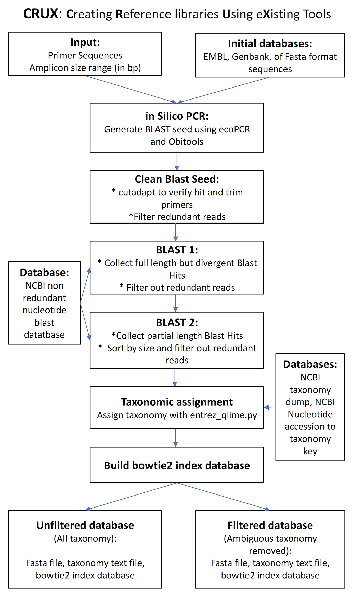

<p align="center">

</p>

# CRUX: Creating Reference libraries Using eXisting tools

### CRUX		last updated 4-11-2018
#### Written by Emily Curd (eecurd@g.ucla.edu), Gaurav Kandlikar (gkandlikar@ucla.edu), and Jesse Gomer (jessegomer@gmail.com). Assistance was provided by Max Ogden (max@maxogden.com).

#### Developed at UCLA for the University of California Conservation Genomics Consortium's CALeDNA Program

## Introduction

Taxonomic assignments of metabarcoding reads requires a comprehensive reference library. There are preexisting high quality reference libraries that are compatible with 16S and 18S metabarcode primers (Glöckner et al., 2017, DeSantis et al., 2006). There are few other comprehensive metabarcode specific reference libraries. Using  **CRUX**: **C**onstructing **R**eference libraries **U**sing e**X**isting tools (CRUX) we are able to construct custom reference libraries given a primer set and several publicly available databases.

CRUX generates custon reference libraries by first running in silico PCR (**ecoPCR**; Ficetola et al., 2010) against the EMBL standard nucleotide sequence database (Stoesser et al., 2002) to generate a seed library of reads with unique taxon identifiers. Other nucleotide databases can also be used in this step (e.g. genbank, custom fasta files, etc.).  CRUX verifies that the seed library reads match the amplicon by checking for the correct primer regions and trimming them using **cutadapt** (Martin, 2011).  

Because many sequencing records are deposited to Genbank (Benson et al., 2012) with the primer regions removed from the read, we **BLAST** (Camacho et al., 2009) the seed library against the NCBI nucleotide blast database (ftp://ftp.ncbi.nlm.nih.gov/blast/). CRUX runs blastn twice.  The first blastn run only accepts full length reads (e.g. the same length as the Reference) and then de-replicates the resulting fasta files by NCBI accession version number. The second blastn run accepts reads up to 70% of full length (because many hits to metabarcodes do not cover the entire read length).  The resulting reads are sorted by length and de-replicated so that only the longest version of a read is retained.

A corresponding taxonomy identification file (superkingdom, phylum, class, order, family, genus, species) is generated from the fasta formatted blast output using **entrez-qiime** (https://github.com/bakerccm/entrez_qiime), the NCBI’s taxonomy dump and map of association between taxonomy and accession version numbers (ftp://ftp.ncbi.nlm.nih.gov/pub/taxonomy/). Because NCBI taxonomy is not always complete (e.g. uncultured organisms, organisms with unknown taxonomy, etc.) CRUX generates two sets of reference files: filtered and unfiltered.  The filtered reference files exclude reads with the following in their taxonomic path: 'unassigned', 'unknown', 'uncultured', 'environmental', 'sample', or 'NA;NA;NA;NA'.

The downstream metabarcoding Anacapa pipeline (https://github.com/limey-bean/Anacapa) runs **Bowtie2** (Langmead et al., 2009) to assigns reads to these references databases and generate a corresponding taxonomy file. Thus the final step is to generate **Bowtie2** formatted data index libraries.

## Overview
<p align="center">

</p>

## Before CRUX is operable, you will need to download, install and/or build several programs and databases.
**__First clone the CRUX_Creating-Reference-libraries-Using-eXisting-tools repository.__** Within the repository is the __crux_db__ directory.  All of the the executables, some of the programs and all database folders should be accessible from this folder.

However, *if you already have any these programs or databases*, there is no need to add them to the crux_db folder-- instead, you can update the file paths or loading commands in the `crux_config.sh` and `crux_vars.sh` files in the `~CRUX_Creating-Reference-libraries-Using-eXisting-tools/crux_db/scripts` directory.  If you choose to do this, your final directory structure should resemble the following:
```
~/CRUX_Creating-Reference-libraries-Using-eXisting-tools/
	crux_db
		accession2taxonomy    	*added by the user*
		crux.sh
		ecoPCR 			*added by the user*
		ncbi-blast-2.6.0+   	*added by the user*
		NCBI_blast_nt     	*added by the user*
		Obitools_databases      *added by the user*
		scripts
		TAXO      		*added by the user*
	.gitignore
	Crux_flow.png
	Manual_addition_or_reads_to_CRUX.txt
	README.md
```
**The folders that are added by the user can be stored elsewhere as long as the file paths are correct in the crux_config.sh and crux_vars.sh files.**

**__Programs__**


1. OBItools:
         https://git.metabarcoding.org/obitools/obitools/wikis/home
	* OBItools is used to generate reference libraries for the ecoPCR in silico PCR step for CRUX.
	* OBItools does not need to be installed in the crux_db folder.
	* Installation information can be found here:  
           http://metabarcoding.org//obitools/doc/welcome.html#installing-the-obitools

2. ecoPCR:
         https://git.metabarcoding.org/obitools/ecopcr/wikis/home
	* If you are not modifying the crux_config.sh, then the path to the ecoPCR executable should be as follows: `~/crux_db/ecoPCR/src/ecoPCR`

3. cutadapt (Version: 1.16):
         http://cutadapt.readthedocs.io/en/stable/index.html
      * cutadapt does not need to be installed in the crux_db folder, however you will need to verify that the crux_config.sh is modified for you computing environment.

4. BLAST+ (version 2.6.0):
         https://www.ncbi.nlm.nih.gov/books/NBK279690/
	* the BLAST executables can be downloaded from: ftp.ncbi.nlm.nih.gov/blast/executables/blast+/2.6.0/ncbi-blast-2.6.0+-x64-linux.tar.gz
	* extract the tar.gz repository: `tar xvzf ~/crux_db/ncbi-blast-2.6.0+-x64-linux.tar.gz`
	* If you are not modifying the crux_config.sh, then the path to the blastn executable should be as follows: `~/crux_db/ncbi-blast-2.6.0+/bin/blastn`

5. entrez_qiime:
        https://github.com/bakerccm/entrez_qiime
	* **entrez_qiime.py** is already included in `~/crux_db/scripts directory`

6. Bowtie2:
        http://bowtie-bio.sourceforge.net/bowtie2/index.shtml
	* Bowtie2 does not need to be installed in the `crux_db` folder, however you will need to verify that the `crux_config.sh` file is modified for your computing environment.


**__Databases to download__**
***__Any time you download a new blastn database, Download the newest TAXO dump and NCBI accession2taxonomy file!!!__***
***__See the download.sh script to automate downloading databases.  Modify the EMBL and OBITools section to download and obiconvert more than fungi__***

1. NCBI taxonomy dump:  
        ftp://ftp.ncbi.nlm.nih.gov/pub/taxonomy/taxdump.tar.gz
 * If you are not modifying the crux_config.sh, then the path to the taxonomy folder should be as follows: `~/crux_db/TAXO`

  * The folder should contain the following files: `delnodes.dmp`, `merged.dmp`, `names.dmp`, `nodes.dmp`
  * download information can be found here: https://github.com/bakerccm/entrez_qiime/blob/master/entrez_qiime.pdf

2. NCBI accession2taxonomy file: ftp://ftp.ncbi.nih.gov/pub/taxonomy/accession2taxid/nucl_gb.accession2taxid.gz
	* If you are not modifying the crux_config.sh, then the path to the accession to taxonomy file should be as follows: `~/crux_db/accession2taxonomy/nucl_gb.accession2taxid`

	* download information can be found here: https://github.com/bakerccm/entrez_qiime/blob/master/entrez_qiime.pdf

3. NCBI BLAST nt library: ftp://ftp.ncbi.nlm.nih.gov/blast/db/

  ```
  mkdir ~/crux_db/NCBI_blast_nt
  cd ~/crux_db/NCBI_blast_nt
  wget ftp://ftp.ncbi.nlm.nih.gov/blast/db/nt*
  for file in nt*.tar.gz; do tar -zxf $file; done
  ```
  * you should have a file structure as follows:
```
    /NCBI_blast_nt
	nt.00.nhr
	.00.nin
	.00.nnd
	.00.nni
	...
```

4. Database files for generating ecoPCR compatible OBItools libraries
  * __all libraries need to be in__  `~/crux_db/Obitools_databases` __directory and have__ `OB_dat_` __as a folder and file prefix__
  * If the names are not correct the run will fail.
  * see [Obitools documentation](https://pythonhosted.org/OBITools/) for range of file types that can be converted into ecoPCR searchable libraries

__The following is an example using EMBL std nucleotide database files. This is only one of may ways to build an Obitools database. The CALeDNA CRUX libraries were generated using OBITools databases generated using EMBL std nucleotide database files.__

Step 1. Download EMBL nucleotide library files:
ftp://ftp.ebi.ac.uk/pub/databases/embl/release/std
They are grouped by the following:
```
Division                 Code
----------------         ------------------
Bacteriophage            PHG - common
Environmental Sample     ENV - common
Fungal                   FUN - map to PLN (plants + fungal)
Human                    HUM - map to PRI (primates)
Invertebrate             INV - common
Other Mammal             MAM - common
Other Vertebrate         VRT - common
Mus musculus             MUS - map to ROD (rodent)
Plant                    PLN - common
Prokaryote               PRO - map to BCT (poor name)
Other Rodent             ROD - common
Synthetic                SYN - common
Transgenic               TGN - ??? map to SYN ???
Unclassified             UNC - map to UNK
Viral                    VRL - common
```               
* For CALeDNA CRUX reference libraries we used FUN, INV, VRT, PLN, PRO, and OTHER (present in older releases e.g ENA Release 133).
* We found that the BLAST steps of CRUX pick up a wide diversity of reads and not all EMBL std nucleotide libraries are required to recover taxa. For example, we recovered he same number of mammal species when running CRUX using only the vrt EMBL libraries as when using both the vrt and mam EMBL libraries.

* These are very large files, and it is less memory intensive to download them in small batches, and convert them into many small obitools/ecopcr readable databases.

* In a temporary folder, download a single EMBL std nucleotide library:
    ```
    wget ftp://ftp.ebi.ac.uk/pub/databases/embl/release/std/rel_std_fun*
    ```

    etc... The libraries will resemble the following:
    ```
    rel_std_fun_01_r133.dat.gz  
    rel_std_fun_02_r133.dat.gz
    ```

    Unzip the files
    ```
    gunzip *.gz
    ```

Step 2. Build the libraries
* The user will need to make  `~/Obitools_databases` and subdirectories that reflect the EMBL std nucleotide databases chosen for building CRUX reference libraries.
  * The directory structure will resemble the following:

```
      ~/Obitools_databases
    	 OB_dat_EMBL_1108017_std_inv    
    	 OB_dat_EMBL_1108017_std_pln
    	 OB_dat_EMBL_1108017_std_fun
    	 OB_dat_EMBL_1108017_std_other
    	 OB_dat_EMBL_1108017_std_pro  
    	 OB_dat_EMBL_1108017_std_vrt
```

      __The subdirectory names will vary depending on the user downloaded EMBL std nucleotide library, date etc. The only requirement it that subdirectory begin with *OB_dat*__

* Convert EMBL std nucleotide databases into obitools/ecopcr readable databases using obiconvert
* the obiconvert python script is part of the OBItools.
	* the documentation can be found here:
          http://metabarcoding.org/obitools/doc/scripts/obiconvert.html
	* a tutorial can be found here:
          http://metabarcoding.org/obitools/doc/wolves.html
* The obiconvert command requires:
	* the path to the ncbi taxonomy folder (`-t`)
		* downloaded above `~/crux_db/TAXO`
	* the file format (`--embl`)
	* the output folder path (`--ecopcrdb-output`)
		* the file path needs to be

    ```
    ~/crux_db/Obitools_databases/OB_dat_some_folder_name_that_corresponds_to_the_type_of_embl_sequences/OB_dat_some_folder_name_that_corresponds_to_the_type_of_embl_sequences
    ```
    e.g.

    ```
    ~/crux_db/Obitools_databases/OB_dat_EMBL_1108017_std_fun/OB_dat_EMBL_1108017_std_fun*
    ```
    * the input file(s) path(s)
    * e.g. the folder where all fungal (fun) files are stored in a single and separate folder
    * Depending on the size of the EMBL database files this may take a lot of time and a lot of RAM
    * The command is as follows:

    ```
    obiconvert -t </path/to/taxonfile> --embl --ecopcrdb-output=/path/to/output /path/to/inputs --skip-on-error
    ```
e.g.

    ```
    obiconvert -t ~/crux_db/TAXO --embl --ecopcrdb-output=~/crux_db/Obitools_databases/OB_dat_EMBL_1108017_std_fun/OB_dat_EMBL_1108017_std_fun ~/EMBL_fun/\*.dat --skip-on-error
    ```
* The resulting files will resemble the following:
```
 ~/OB_dat_EMBL_1108017_std_fun
    OB_dat_EMBL_1108017_std_fun_001.sdx
    OB_dat_EMBL_1108017_std_fun_002.sdx
    OB_dat_EMBL_1108017_std_fun.adx
    OB_dat_EMBL_1108017_std_fun.ndx
    OB_dat_EMBL_1108017_std_fun.rdx
    OB_dat_EMBL_1108017_std_fun.tdx
```

## Running CRUX
### CRUX scripts can be run locally on a personal computer (-l see optional arguments below), or in a High Performance Computing Environment (HPC).

## Step by Step Explanation of CRUX

### Crux Part 1: ecoPCR, BLAST 1 and BLAST 2
1. Run ecoPCR using the user specified primer on the user generated OBItools compatible databases.  
  * ecoPCR parameters can be altered in `/crux_db/scripts/crux_vars.sh`
2. ecoPCR results are de-replicated based on taxon id (taxid), and converted to fasta format.
3. cutadapt is used to verify and retain only the ecoPCR reads with correct primer sequences, then trim the primers from the 5' and 3' ends.
4. Clean fasta files are used as seeds to generate two BLAST libraries: a full length BLAST library, and an up-to 70% (or user's choice) length BLAST library.
  * These seed files are broken in to 500 read chunks and blasted as an array against blasted against the NCBI nucleotide blast databases using blastn.
  * The full length library:
    * minimum percent of subject that needs to be covered by the query = 50%
    * minimum percent identity of the query relative to the subject = 100%    
    * up to 10000 hits are retained

  * The partial length library:
    * minimum percent of subject that needs to be covered by the query = 70%
    * minimum percent identity of the query relative to the subject = 70%
    * up to 10000 hits are retained

  * blastn parameters can be altered in the command line or in  `crux_db/scripts/crux_vars.sh`
  * On an HPC, each CO1 seed file requires up to ~25 GB of memory for 1.5 hours
  * BLAST array jobs submission scripts can be found in: `crux_db/<metabarcode>/Run_logs/blast_jobs/*_blast*.sh`

  5. The blast results are de-replicated by NCBI accession version number and converted into fasta format. Only the longest instance of a read is retained.
  6. entrez-qiime.py is used to determine taxonomy for each read based on its NCBI version accession number.
  7. An additional database of taxonomy filtered reads is generated.  
    * Reads with taxonomy identified as `NA;NA;NA;NA`, or with "uncultured", "unknown", "unassigned", or "environmental" in the name are removed from the cleaned blast results fasta output and corresponding taxonomy file.
  8. bowtie2-formatted index libraries for the filtered and unfiltered databases are generated
  9. Files from intermediate steps are cleaned

CRUX is run as follows:
```
/bin/bash ~/crux_db/crux.sh -h

<<< CRUX: Sequence Creating Reference Libraries Using eXisting tools>>>

The purpose of these script is to generate metabarcode locus specific reference libraries. This script takes PCR primer sets, runs ecoPRC (in silico PCR) on EMBL (or other OBITools formatted) databases, then BLASTs the resulting sequences ncbi's nr database, and generates database files for unique NCBI sequences. The final databases are either filtered (sequences with ambiguous taxonomy removed) of unfiltered and consist of a fasta file, a taxonomy file, and a Bowtie2 Index library.
	For successful implementation
		1. Make sure you have all of the dependencies and correct paths in the crux_config.sh file
		2. All parameters can be modified using the arguments below.  Alternatively, all parameters can be altered in the crux_vars.sh folder

Arguments:
- Required:
	-n	Metabarcode locus primer set name
	-f	Metabarcode locus forward primer sequence  
	-r	Metabarcode locus reverse primer sequence  
	-s	Shortest amplicon expected (e.g. 100 bp shorter than the average amplicon length
	-m	Longest amplicon expected (e.g. 100 bp longer than the average amplicon length
	-o	path to output directory
	-d	path to crux_db

- Optional:
	-x	If retaining intermediate files: -x (no argument needed; Default is to delete intermediate files)
	-u	If running on an HPC (e.g. UCLA's Hoffman2 cluster), this is your username: e.g. eecurd
	-l	If running locally: -l  (no argument needed)
	-k	Chunk size for breaking up blast seeds (default 500)
	-e	Maximum number of mismatch between primers and EMBL database sequences (default 3)
	-g	Maximum number of allowed errors for filtering and trimming the BLAST seed sequences with cutadapt (default 0.3)
	-t	The number of threads to launch for the first round of BLAST (default 10)
	-v	The minimum accepted value for BLAST hits in the first round of BLAST (default 0.00001)
	-i 	The minimum percent ID for BLAST hits in the first round of BLAST (default 50)
	-c	Minimum percent of length of a query that a BLAST hit must cover (default 100)
	-a	Maximum number of BLAST hits to return for each query (default 10000)
	-z	BLAST gap opening penalty
	-y	BLAST gap extension penalty
	-j	The number of threads to launch for the first round of BLAST (default 10)
	-w	The minimum accepted value for BLAST hits in the first round of BLAST (default 0.00001)
	-p 	The minimum percent ID for BLAST hits in the first round of BLAST (default 70)
	-q	Minimum percent of length of a query that a BLAST hit must cover (default 70)
	-b	HPC mode header template

- Other:
	-h	Shows program usage then quits
```


* An example of running CRUX in local mode:

  ```
  /bin/bash ~/Crux/crux_db/crux.sh -n 12S -f GTCGGTAAAACTCGTGCCAGC -r CATAGTGGGGTATCTAATCCCAGTTTG -s 80 -m 280 -o ~/Crux/crux_db/12S -d ~/Crux/crux_db -l
  ```
* An example of running CRUX in HPC mode:

  ```
  /bin/bash ~/Crux/crux_db/crux.sh -n 12S -f GTCGGTAAAACTCGTGCCAGC -r CATAGTGGGGTATCTAATCCCAGTTTG -s 80 -m 280 -o ~/Crux/crux_db/12S -d ~/Crux/crux_db -u eecurd
    ```
    
## Manual CRUX Library Generation
Some users may wish to generate their own CRUX formatted reference database to be able to run the *Anacapa Toolkit*. Typically this is if users have generated their own reference barcodes that are not yet publicly available. Please see the provided detailed instructions on how to either generated a CRUX formatted reerence database or append additional reference barcodes to an existing CRUX DB. https://github.com/limey-bean/CRUX_Creating-Reference-libraries-Using-eXisting-tools/blob/master/Manual_addition_of_reads_to_CRUX.txt


## References:

Benson, D.A., Cavanaugh, M., Clark, K., Karsch-Mizrachi, I., Lipman, D.J., Ostell, J. and Sayers, E.W., 2012. GenBank. Nucleic acids research, 41(D1), pp.D36-D42.

Camacho, C., Coulouris, G., Avagyan, V., Ma, N., Papadopoulos, J., Bealer, K. and Madden, T.L., 2009. BLAST+: architecture and applications. BMC bioinformatics, 10(1), p.421.

Caporaso, J.G., Kuczynski, J., Stombaugh, J., Bittinger, K., Bushman, F.D., Costello, E.K., Fierer, N., Peña, A.G., Goodrich, J.K., Gordon, J.I. and Huttley, G.A., 2010. QIIME allows analysis of high-throughput community sequencing data. Nature methods, 7(5), pp.335-336.

DeSantis, T.Z., Hugenholtz, P., Larsen, N., Rojas, M., Brodie, E.L., Keller, K., Huber, T., Dalevi, D., Hu, P. and Andersen, G.L., 2006. Greengenes, a chimera-checked 16S rRNA gene database and workbench compatible with ARB. Applied and environmental microbiology, 72(7), pp.5069-5072.

Edgar, R.C., 2010. Search and clustering orders of magnitude faster than BLAST. Bioinformatics, 26(19), pp.2460-2461.

Ficetola, G.F., Coissac, E., Zundel, S., Riaz, T., Shehzad, W., Bessière, J., Taberlet, P. and Pompanon, F., 2010. An in silico approach for the evaluation of DNA barcodes. BMC genomics, 11(1), p.434.

Glöckner, F.O., Yilmaz, P., Quast, C., Gerken, J., Beccati, A., Ciuprina, A., Bruns, G., Yarza, P., Peplies, J., Westram, R. and Ludwig, W., 2017. 25 years of serving the community with ribosomal RNA gene reference databases and tools. Journal of Biotechnology.

Martin, M., 2011. Cutadapt removes adapter sequences from high-throughput sequencing reads. EMBnet. journal, 17(1), pp.pp-10.

Langmead, B., Trapnell, C., Pop, M. and Salzberg, S.L., 2009. Ultrafast and memory-efficient alignment of short DNA sequences to the human genome. Genome biology, 10(3), p.R25.

Stoesser, G., Baker, W., van den Broek, A., Camon, E., Garcia-Pastor, M., Kanz, C., Kulikova, T., Leinonen, R., Lin, Q., Lombard, V. and Lopez, R., 2002. The EMBL nucleotide sequence database. Nucleic acids research, 30(1), pp.21-26.
